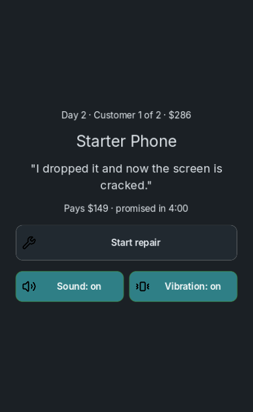
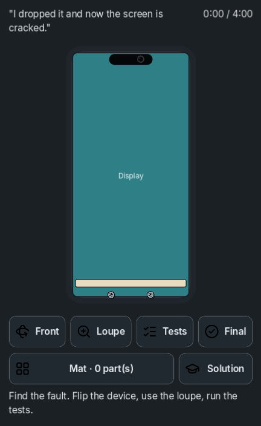
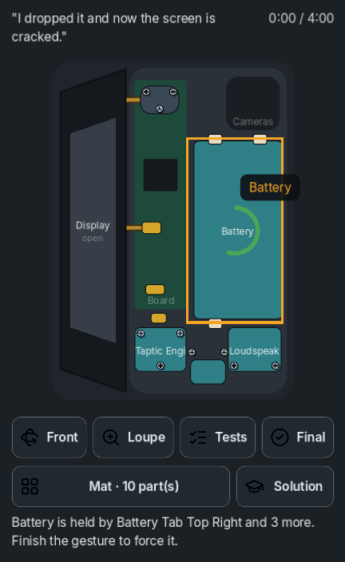
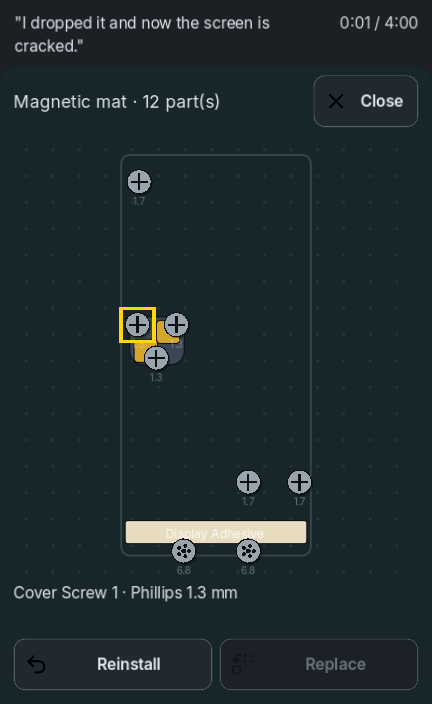
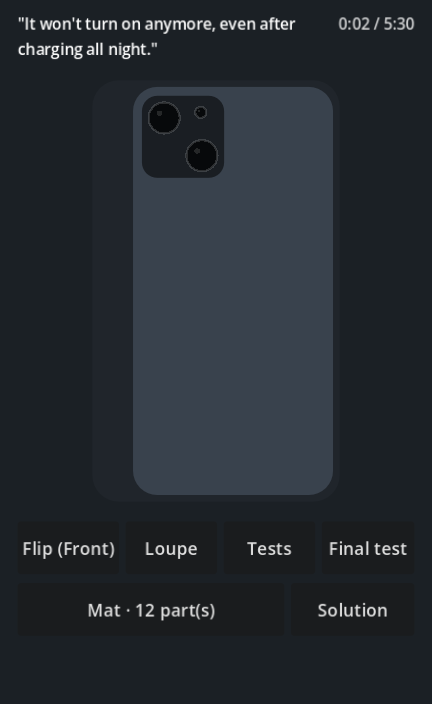
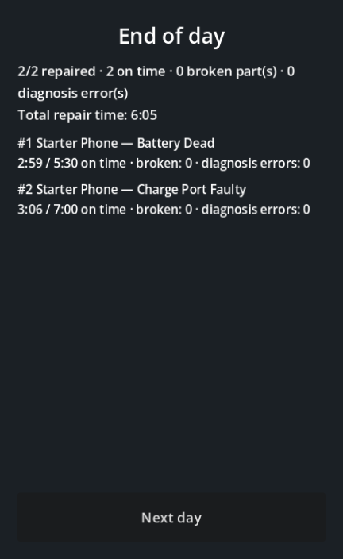

# Teardown Bench

[](https://github.com/Leirbagg/teardown_bench/actions/workflows/tests.yml)

Simulateur 2D de réparation de smartphones pour Android (portrait), fait avec Godot 4.
Un client dépose un appareil avec une plainte : on diagnostique, on démonte au doigt, on
remplace la pièce, on remonte et on lance le test final.

> Nom de travail. Les appareils sont des analogues fictifs : aucun nom de marque ni de modèle réel.

<p align="center">
  
  
  
  
  
  
</p>

## Le jeu

- **Le geste avant tout.** Chaque pièce a son geste : tourner une vis, tirer une nappe, chauffer
  un adhésif, faire levier le long d'un bord. La pièce suit le doigt, avec sons et vibrations.
- **On punit l'intention, pas la précision.** Un geste raté se réessaie sans conséquence. Seule
  une mauvaise décision casse quelque chose : forcer un écran encore collé, débrancher une nappe
  avant la batterie, tirer une batterie encore tenue par ses languettes.
- **Un process fidèle.** L'appareil suit l'ordre réel de réparation d'après les guides publics :
  joint chauffé, écran rabattu comme un livre, caches vissés, batterie débranchée en premier,
  languettes adhésives, haut-parleur, vibreur, port de charge collé.
- **Diagnostic.** Plainte du client, loupe, tests logiciels, test final ; les remplacements
  inutiles comptent comme erreurs au bilan.
- **Tapis magnétique.** Chaque vis et chaque pièce retirée reste posée à sa place d'origine, avec sa
  tête et sa longueur. Un écran ouvert reste rabattu à côté de l'appareil tant que ses nappes
  sont branchées.
- **Mode solution.** Un doigt fantôme montre chaque geste, étape par étape et commenté, depuis
  l'état où l'on en est. La réparation compte alors comme assistée.
- **Atelier.** Chaque réparation paie le prix de la panne, moins les pièces posées ; casser ou
  remplacer à tort mange la marge. Les étoiles font monter la réputation, qui débloque du contenu.
  La progression est sauvegardée après chaque client.

Détails : [GDD](GDD.md) · [schéma des données et règles](docs/data_schema.md).

## État

MVP jouable sur téléphone : la gamme entière est fichée, de l'*ipone x* à l'*ipone 17 pro max*
(30 modèles), dont **1 démontable**, l'*ipone 13* : 43 pièces et 4 procédures recoupées pas à pas
sur les guides publics — 4 pannes (écran,
batterie, port de charge, capteurs frontaux), journées de 2 à 3 clients, économie (prix des pannes,
coût des pièces, note en étoiles, réputation) et sauvegarde après chaque client. Pas encore de
stock à acheter, d'upgrades d'outils ni de monétisation (voir « Hors périmètre » dans le GDD).

## Démarrer

Prérequis : [Godot 4.7.2](https://godotengine.org/download) (méthode de rendu Mobile).

```bash
godot --path .                                        # lancer le jeu (la souris simule le doigt)
godot -e --path .                                     # ouvrir l'éditeur
godot --headless --import --path .                    # importer le projet
godot --headless --path . --script res://tests/run_tests.gd   # suite de tests
godot --headless --path . --script res://tests/run_tests.gd -- scoring   # une suite (fragment de nom)
```

Le jeu s'ouvre sur le **choix du modèle** : la gamme entière, groupée par famille de démontage.
Seuls les modèles dont le démontage existe s'ouvrent ; les autres se lisent en attendant.

Un appui long sur le résumé (choix du modèle), le compteur de clients (accueil) ou le chrono
(établi) ouvre l'écran de
diagnostic : taille de la vue, zone sûre, marges appliquées, densité de l'écran. De quoi cerner
un souci d'affichage sur un vrai téléphone sans avoir à le décrire.

### APK Android (debug)

Prérequis supplémentaires : modèles d'export Android de Godot 4.7.2, JDK 17, SDK Android avec
build-tools, keystore de debug (`~/.local/share/godot/keystores/debug.keystore`).

```bash
./scripts/build_android.sh                 # tests puis build/repa_debug.apk
adb install -r build/repa_debug.apk
```

Le SDK est lu dans `ANDROID_HOME` (par défaut `~/Android/Sdk`). La version est calculée depuis git :
`versionCode` = nombre de commits (toujours croissant), `versionName` = `git describe`.

### Publier une version

Pousser un tag `v*` construit l'APK sur GitHub Actions et publie une **Release** avec l'APK en
pièce jointe :

```bash
git tag v0.2.0
git push origin v0.2.0
```

Un tag avec un tiret (`v0.2.0-beta1`) publie une pré-release. Sans tag, **Actions → APK debug →
Run workflow** construit l'APK et le dépose en artefact.

**Signature stable.** Android n'installe une mise à jour que si elle est signée avec la même clé
que la version installée. Tous les APK (locaux et CI) sont donc signés avec le même keystore de
debug, fourni à la CI par des secrets du dépôt (**Settings → Secrets and variables → Actions**) :

| Secret | Valeur |
|---|---|
| `DEBUG_KEYSTORE_BASE64` | Obligatoire. Le keystore encodé : `base64 -w0 ~/.local/share/godot/keystores/debug.keystore` |
| `DEBUG_KEYSTORE_PASSWORD` | Facultatif, `android` par défaut |
| `DEBUG_KEYSTORE_ALIAS` | Facultatif, `androiddebugkey` par défaut |

Garder une copie du keystore en lieu sûr : le perdre oblige à désinstaller le jeu pour installer
les versions suivantes. Ne jamais le versionner (`*.keystore` est exclu par `.gitignore`).

**Sur le téléphone.** Télécharger l'APK depuis la page Releases, ou installer
[Obtainium](https://github.com/ImranR98/Obtainium) et lui donner l'URL du dépôt : il propose chaque
nouvelle Release comme mise à jour. Pour un dépôt privé, Obtainium demande un jeton GitHub en
lecture seule.

## Organisation

| Dossier | Contenu |
|---|---|
| `core/` | Règles du jeu en GDScript pur, testables sans écran : graphe de démontage, diagnostic, journée et bilan, économie, sauvegarde, plan du mode solution, chargement et validation des données |
| `game/` | Scènes, interface, reconnaissance des gestes, rendu, sons et vibrations. Consomme `core/`, n'ajoute aucune règle |
| `data/` | Appareils, pannes et fiches des modèles en JSON, listés dans `data/preload_manifest.json` |
| `assets/audio/` | Effets sonores générés par `scripts/generate_sfx.py` |
| `tests/` | Suites (`tests/cases/test_*.gd`) et fichiers de test |
| `docs/` | Schéma des données, captures |

Police et icônes : voir [CREDITS.md](CREDITS.md). Le thème commun est `game/ui/theme.tres`.

Les conventions et pièges connus sont décrits dans [CLAUDE.md](CLAUDE.md).

## Ajouter un appareil ou une panne

1. Créer `data/devices/<id>.json` ou `data/faults/<id>.json` selon
   [le schéma](docs/data_schema.md). Le démontage est un graphe : chaque pièce liste ses
   prérequis (`requires`), jamais une séquence codée en dur.
2. L'ajouter à `data/preload_manifest.json`, sinon il ne sera pas exporté dans l'APK.
3. Lancer les tests : ils valident chaque fichier (cycles, prérequis manquants, pièces
   orphelines…), vérifient le manifeste et démontent puis remontent chaque appareil.

## Sons

Les sons sont synthétisés, sans asset externe :

```bash
python3 scripts/generate_sfx.py
```
